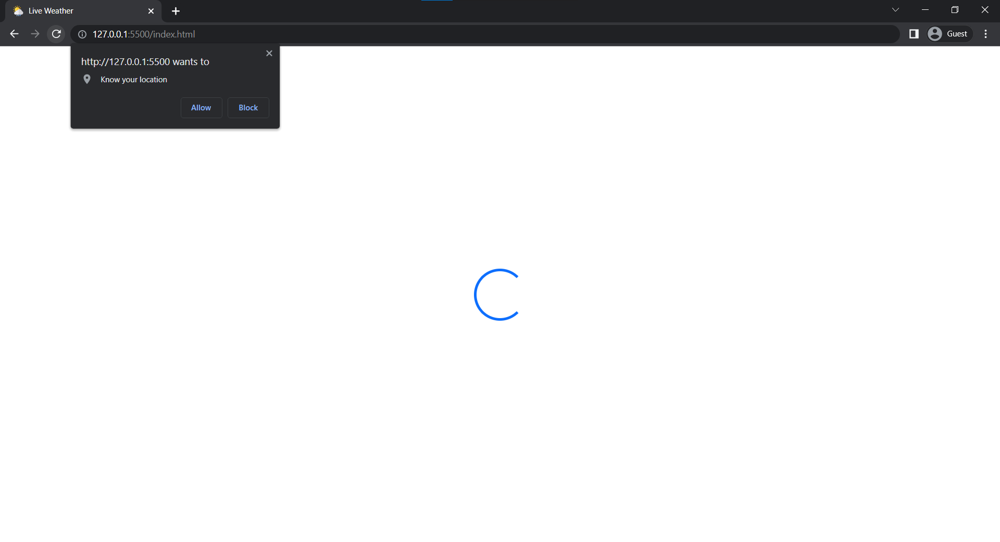
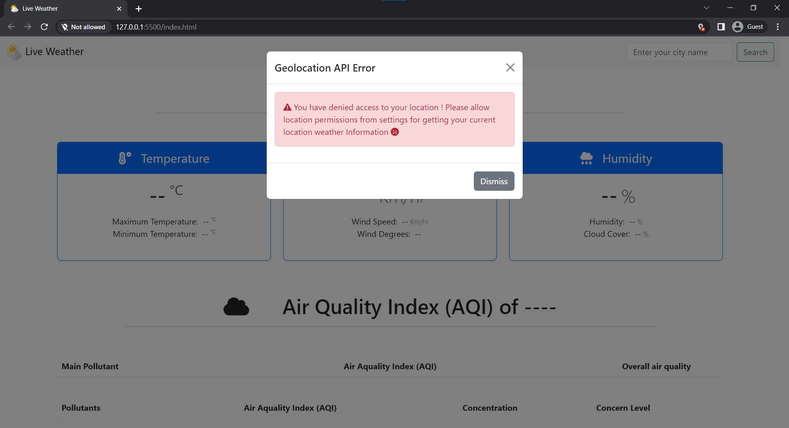
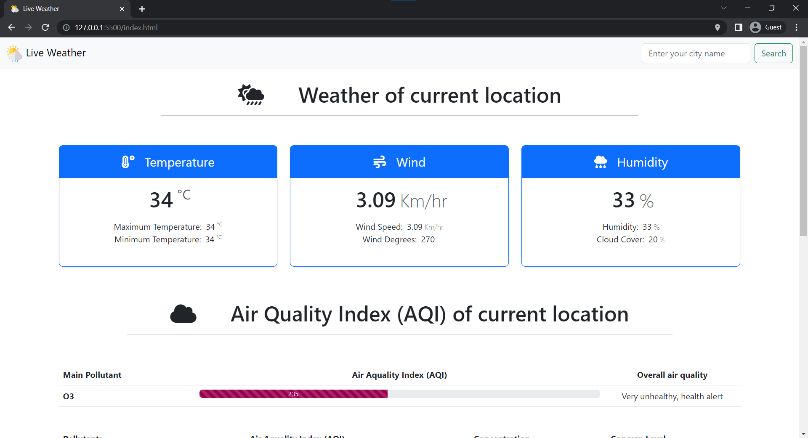
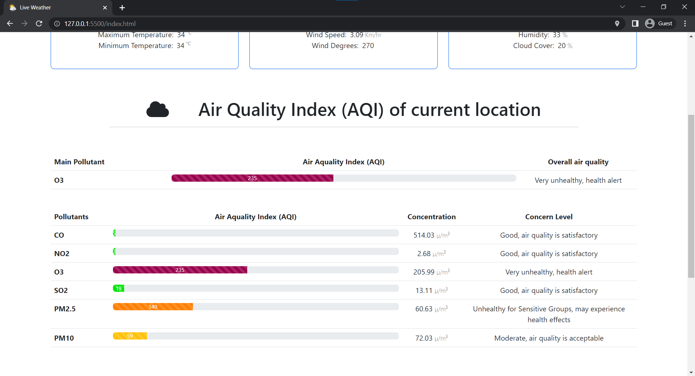
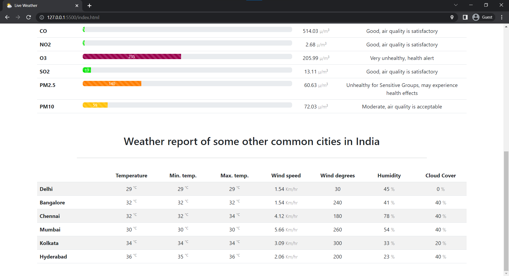
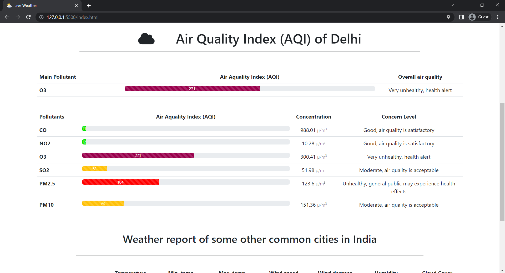
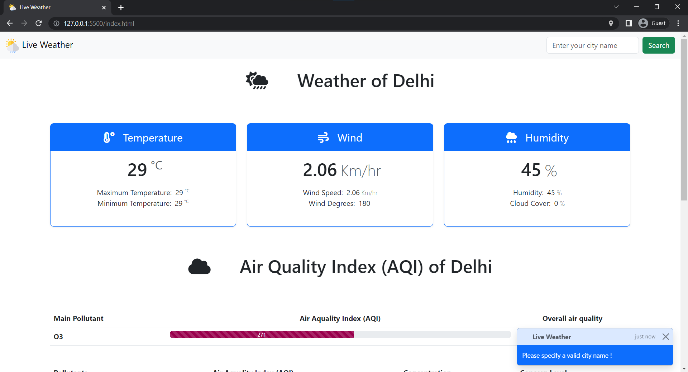
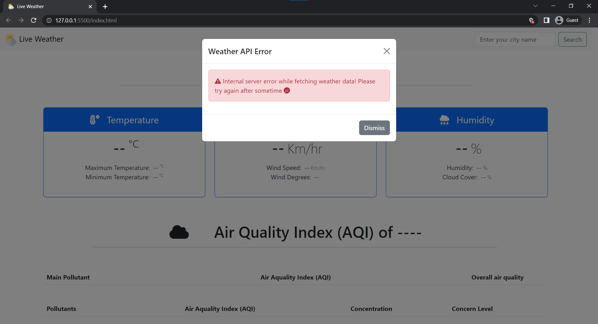

# Weather Application using HTML, CSS, and Javascript

A simple weather application made using HTML5, CSS and Javascript. The application fecthes weather data from the weather api provided by [Rapid API](https://rapidapi.com/). Read more about [Weather API - API Ninjas](https://api-ninjas.com/api/weather) and [Air Quality API - API Ninjas](https://api-ninjas.com/api/airquality).

## Tech Stack

- HTML5
- CSS
- Bootstrap v5.3
- Javascript
- JQuery v3.6.4
- Handlebars.js v4.7.7

## Features

- Fetches weather data from weather API
- Uses geolocation API to fetch current location weather
- Uses bootstrap, CSS framework to provide a beautiful UI

## Installation

Follow the steps for installing the application:

- Step-1: Clone the repository.
- Step-2: Create an account at [Rapid API](https://rapidapi.com/) and get your API key for [Weather API - API Ninjas](https://rapidapi.com/apininjas/api/weather-by-api-ninjas/) and [Air Quality API - API Ninjas](https://rapidapi.com/apininjas/api/air-quality-by-api-ninjas/).
- Step-3: Open the cloned project folder and locate the 'apiKey.js' file in './js/apiKey.js' and paste your API keys.
- Step-4: All set. Now , you are good to go. Open index.html page with live server extension in VS code or any other server that supports http requests.

## Screenshots

## Demo

